# Sơ Đồ Tư Duy (Mindmap) Các Vai Trò QA/QC Theo Chuẩn ISTQB (CLO G9.1)

> **Mục tiêu Chuẩn đầu ra (CLO G9.1):** Yêu cầu một công cụ AI vẽ sơ đồ tư duy (mindmap) về các vai trò/quy trình QA/QC theo chuẩn ISTQB và phát hiện ít nhất **3 lỗi sai / điểm thiếu sót** của AI để hiệu chỉnh lại theo chuẩn ISTQB CTFL v4.0.

---

## 1. Sơ Đồ Tư Duy Hiệu Chỉnh Hoàn Thiện (Corrected Mindmap - Markdown Mermaid)

```mermaid
graph TD
    Root["Hệ Thống Đảm Bảo & Kiểm Soát Chất Lượng (QA/QC theo ISTQB)"]

    %% Branch 1: Quality Assurance
    Root --> QA["1. Quality Assurance (QA)<br>Định hướng Quy trình (Process-Oriented)"]
    QA --> QA_Focus["Mục tiêu: Ngăn ngừa lỗi (Defect Prevention)"]
    QA --> QA_Roles["Các vai trò chính"]
    QA_Roles --> PQA["Process QA / QA Lead<br>- Xây dựng & cải tiến quy trình SDLC<br>- Đánh giá tuân thủ quy trình (Audit & Compliance)<br>- Phân tích số liệu chất lượng (Quality Metrics)"]
    QA_Roles --> SQA["Software Quality Analyst<br>- Chuẩn hóa quy trình kiểm thử<br>- Huấn luyện & chia sẻ best practices<br>- Quản lý rủi ro quy trình"]

    %% Branch 2: Quality Control & Testing
    Root --> QC["2. Quality Control & Testing (QC)<br>Định hướng Sản phẩm (Product-Oriented)"]
    QC --> QC_Focus["Mục tiêu: Phát hiện lỗi & đo lường chất lượng sản phẩm"]
    
    %% Role Group 1: Test Management Role
    QC --> TMR["Nhóm Vai Trò Quản Lý Kiểm Thử<br>(Test Management Role)"]
    TMR --> TM["Test Manager / Test Lead"]
    TM --> TM_Task1["Lập Kế hoạch kiểm thử (Test Planning)"]
    TM --> TM_Task2["Giám sát & Kiểm soát kiểm thử (Test Monitoring & Control)"]
    TM --> TM_Task3["Đánh giá tiêu chí kết thúc (Exit Criteria) & Lập Test Summary Report"]
    TM --> TM_Task4["Quản lý cấu hình & Điều phối môi trường test"]

    %% Role Group 2: Testing Role (Dynamic & Static)
    QC --> TR["Nhóm Vai Trò Kiểm Thử Kỹ Thuật<br>(Testing Role)"]
    
    TR --> TA["Test Analyst (Manual / Functional Tester)"]
    TA --> TA_Task1["Phân tích cơ sở kiểm thử (Test Basis) & Xác định Test Conditions"]
    TA --> TA_Task2["Thiết kế ca kiểm thử hộp đen (Black-box Test Design)"]
    TA --> TA_Task3["Thực thi kiểm thử & Báo cáo khiếm khuyết (Defect Logging)"]
    TA --> TA_Task4["Trực tiếp tham gia Kiểm thử tĩnh (Static Testing - Review tài liệu)"]

    TR --> TTA["Technical Test Analyst (Automation / Non-Functional)"]
    TTA --> TTA_Task1["Thiết kế kiểm thử hộp trắng (White-box: Statement, Branch Coverage)"]
    TTA --> TTA_Task2["Xây dựng & bảo trì Automation Test Framework (API, UI, CI/CD)"]
    TTA --> TTA_Task3["Kiểm thử phi chức năng (Hiệu năng, An toàn thông tin, Độ tin cậy)"]

    TR --> ST["Static Tester / Reviewer (Thực hiện Kiểm thử tĩnh)"]
    ST --> ST_Task1["Kiểm tra yêu cầu & User Stories (Requirement Review / Shift-Left)"]
    ST --> ST_Task2["Đánh giá mã nguồn (Static Code Analysis / Walkthrough / Inspection)"]

    %% Branch 3: Verification & Validation
    Root --> VV["3. Hoạt Động Cốt Lõi (Activities Across Lifecycle)"]
    VV --> Verif["Verification (Xác minh)<br>'Are we building the product right?'<br>Kiểm tra tính tuân thủ quy chuẩn & thiết kế"]
    VV --> Valid["Validation (Xác thực)<br>'Are we building the right product?'<br>Kiểm tra đáp ứng nhu cầu thực tế của End-User"]
```

---

## 2. Phân Tích & Chỉ Ra 3 Lỗi Sai / Nhầm Lẫn Của AI (Theo Chuẩn ISTQB CTFL v4.0)

### 🔴 Lỗi sai #1: Đánh đồng QA với QC hoặc xếp hoạt động kiểm thử (Testing) vào nhánh QA
* **Sai lầm của AI:** Các công cụ AI ban đầu thường gộp chung QA và QC, hoặc xếp các vị trí kỹ thuật như *Manual Tester*, *Automation QC*, *Bug Logger* làm con của nhánh *Quality Assurance*.
* **Cơ sở ISTQB đối chiếu (ISTQB FL v4.0 - Mục 1.2.2 "Quality Assurance and Testing"):**
  * **QA (Quality Assurance)** mang tính **phòng ngừa (defect prevention)** và định hướng theo **quy trình (process-oriented)**. QA giám sát việc tuân thủ quy trình phát triển nhằm giảm thiểu khả năng phát sinh lỗi.
  * **Testing / QC (Quality Control)** mang tính **phát hiện (defect detection)** và định hướng theo **sản phẩm (product-oriented)**. Testing kiểm tra trực tiếp các sản phẩm làm việc (work products) để tìm kiếm lỗi và đo lường độ tin cậy.
* **Hành động hiệu chỉnh của sinh viên:** Tách biệt rõ ràng 2 nhánh độc lập: Nhánh 1 là QA (Quy trình) và Nhánh 2 là QC / Testing (Sản phẩm).

---

### 🔴 Lỗi sai #2: Bỏ quên "Kiểm thử tĩnh" (Static Testing) hoặc coi đó là việc độc quyền của Dev/BA
* **Sai lầm của AI:** AI thường mặc định kiểm thử chỉ là việc chạy chương trình phần mềm (Dynamic Testing) và sinh ra test case trên giao diện người dùng. AI hoàn toàn bỏ qua việc Tester phải tham gia kiểm thử tài liệu ngay từ đầu.
* **Cơ sở ISTQB đối chiếu (ISTQB FL v4.0 - Chương 3 "Static Testing"):**
  * Kiểm thử trong chuẩn ISTQB bao gồm cả **Kiểm thử tĩnh (Static Testing)** và **Kiểm thử động (Dynamic Testing)**.
  * Kiểm thử tĩnh (Reviews, Walkthrough, Inspection, Static Analysis) là trách nhiệm cốt lõi của Tester để tìm ra khiếm khuyết trong tài liệu đặc tả yêu cầu, User Story và kiến trúc hệ thống ngay từ giai đoạn đầu (Shift-Left Testing), giúp tiết kiệm chi phí sửa chữa gấp nhiều lần so với kiểm thử động.
* **Hành động hiệu chỉnh của sinh viên:** Bổ sung nhánh vai trò **Static Testing** vào nhóm kỹ thuật kiểm thử, nêu rõ hoạt động Review yêu cầu và phân tích mã nguồn tĩnh.

---

### 🔴 Lỗi sai #3: Gán quyền quyết định phát hành (Release Go/No-Go Decision) duy nhất cho Test Manager
* **Sai lầm của AI:** AI mô tả vai trò của Test Manager là *"người chịu trách nhiệm đưa ra quyết định cuối cùng có phát hành phần mềm ra thị trường hay không"*.
* **Cơ sở ISTQB đối chiếu (ISTQB FL v4.0 - Mục 1.4.1 & Mục 5.1 "Test Management"):**
  * Test Manager chỉ chịu trách nhiệm lập kế hoạch, theo dõi tiến độ, đối chiếu các **Tiêu chí kết thúc kiểm thử (Exit Criteria)** và lập **Báo cáo tóm tắt kiểm thử (Test Summary Report)** phản ánh trung thực các rủi ro tồn đọng.
  * Quyết định phát hành phần mềm (Release Decision) thuộc thẩm quyền của **các bên liên quan nghiệp vụ (Business Stakeholders, Product Owner, Ban Giám đốc)** dựa trên đánh giá rủi ro kinh doanh và kỹ thuật mà báo cáo kiểm thử cung cấp.
* **Hành động hiệu chỉnh của sinh viên:** Sửa lại chức năng của Test Manager thành *"Đánh giá tiêu chí kết thúc và lập báo cáo tóm tắt rủi ro cung cấp cho Stakeholders quyết định release"*.
