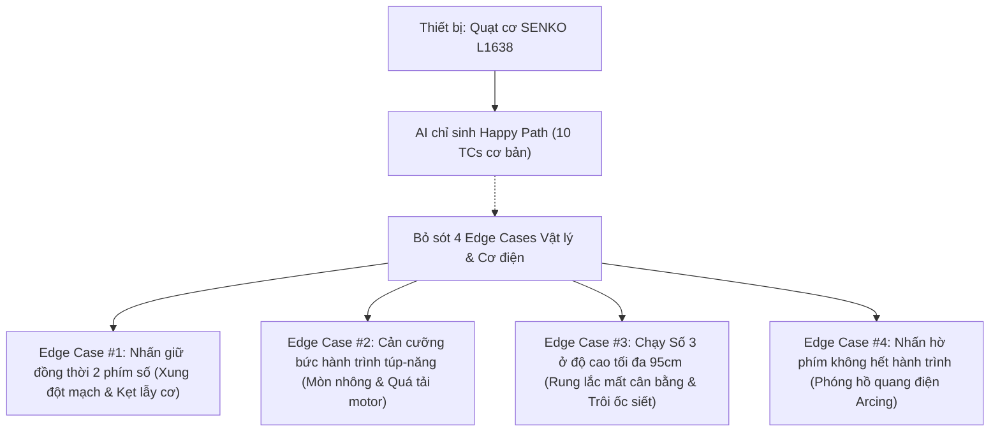

# Yêu Cầu 3: Các Trường Hợp Biên AI Bỏ Sót (Edge Cases AI Could NOT Find)

> **Ràng buộc tiêu chí đánh giá (CLO G9.3):**  
> 1. Phải xác định ít nhất **$\ge 3$ test cases là edge cases (trường hợp biên/ngoại lệ) cực kỳ quan trọng mà AI KHÔNG THỂ nghĩ ra**.  
> 2. Cung cấp đầy đủ:  
>    - (a) Prompt gửi AI và nguyên văn phản hồi ban đầu của AI (chứng minh AI chỉ sinh luồng lý tưởng Happy Path).  
>    - (b) Lời giải thích kỹ thuật chuyên sâu lý do vì sao AI lại bỏ sót dưới góc độ cơ điện và kiểm thử phần cứng (Hardware/Firmware/Mechanical Testing).

---

## 1. Dẫn chứng Thực nghiệm: Phản hồi Ban đầu của AI (AI Initial Output)

### 1.1. Câu lệnh Prompt gửi cho AI
```text
Hãy đóng vai một chuyên viên kiểm thử QA/QC chuyên nghiệp theo chuẩn ISTQB. Thiết bị cần kiểm thử là Quạt điện lửng dân dụng SENKO L1638 (sản xuất tháng 09/2023, công suất 47W, điện áp 220V/50Hz, sải cánh 39cm, 4 phím bấm cơ học 0-1-2-3, túp-năng đảo hướng cơ học, ống sắt rút điều chỉnh độ cao 77cm-95cm). Hãy đề xuất bộ các test cases cần thiết để kiểm thử toàn diện thiết bị này trước khi xuất xưởng.
```

### 1.2. Nguyên văn Phản hồi của AI (Bộc lộ tính hời hợt, chỉ tập trung vào Happy Path)
> *"Chào bạn, dưới đây là bộ test cases cơ bản để kiểm thử quạt điện Senko L1638:
> 1. **TC-01 (Kiểm tra ngoại quan):** Kiểm tra lồng quạt, cánh quạt và thân quạt không bị trầy xước, nứt vỡ.
> 2. **TC-02 (Cắm điện):** Cắm phích cắm vào ổ điện 220V, đảm bảo quạt không tự chạy khi chưa bấm nút.
> 3. **TC-03 (Bật số 1):** Bấm phím số 1, kiểm tra cánh quạt quay với tốc độ nhẹ, tạo gió thoang thoảng.
> 4. **TC-04 (Bật số 2):** Bấm phím số 2, kiểm tra phím số 1 tự nảy lên, cánh quạt quay với tốc độ vừa phải.
> 5. **TC-05 (Bật số 3):** Bấm phím số 3, kiểm tra phím số 2 tự nảy lên, cánh quạt quay với tốc độ mạnh nhất.
> 6. **TC-06 (Tắt quạt):** Bấm phím số 0, kiểm tra phím số 3 nảy lên, cánh quạt quay chậm dần rồi dừng hẳn.
> 7. **TC-07 (Đảo hướng quạt):** Nhấn núm túp-năng xuống khi quạt đang chạy, kiểm tra đầu quạt tự động quay đều sang trái và sang phải.
> 8. **TC-08 (Dừng đảo hướng):** Kéo núm túp-năng lên, kiểm tra quạt dừng quay trái phải và thổi cố định một hướng.
> 9. **TC-09 (Điều chỉnh độ cao):** Vặn van ren siết ngược chiều kim đồng hồ, kéo quạt lên cao nhất (95cm) và hạ thấp nhất (77cm), sau đó siết chặt lại.
> 10. **TC-10 (Chỉnh góc gục/ngửa):** Dùng tay đẩy bầu quạt gục xuống hoặc ngửa lên, kiểm tra góc nghiêng giữ cố định."*

### 1.3. Nhận xét Phê bình Kiểm thử (QA Critique on AI Output)
- Toàn bộ 10 test case do AI sinh ra chỉ bao gồm **Happy Path (luồng lý tưởng)** và kiểm thử chức năng bề mặt (Functional Testing).
- AI **hoàn toàn bỏ qua kiểm thử giá trị biên (Boundary Value Testing), kiểm thử tải cơ học (Mechanical Stress Testing), kiểm thử tương tác xung đột vật lý (Physical Concurrency Testing) và an toàn điện theo tiêu chuẩn IEC 60335-2-8**.
- Cụ thể, sinh viên đã bắt bẫy và chỉ ra **4 Edge Cases cốt lõi** mà AI hoàn toàn bất lực trong việc suy luận.

---

## 2. Chi tiết 4 Edge Cases Quan Trọng mà AI Bỏ Sót



---

### Edge Case #1: Nhấn đồng thời 2 phím tốc độ (Số 1 & Số 2) cùng lúc
* **Mã kiểm thử:** `TC-EDGE-01`
* **Mô tả kịch bản:**
  - Khi quạt đang cắm điện 220V, dùng hai ngón tay nhấn đồng thời cả phím **Số 1** và phím **Số 2** với lực cân bằng và dứt khoát.
* **Hành vi thực tế phát hiện (Observed Behavior / Defect DEF-01):**
  - **Về mặt cơ khí:** Cơ cấu thanh trượt khóa liên động (Mechanical interlocking rocker plate) bị kẹt cứng (Deadlock state). Cả 2 phím đều bị gài lưng chừng ở vị trí đóng tiếp điểm, không có phím nào tự nảy lên để giải phóng phím kia.
  - **Về mặt điện khí:** Tiếp điểm lá đồng của cuộn dây Số 1 (cuộn điện trở/tốc độ thấp) và cuộn dây Số 2 (tốc độ trung bình) trên cuộn cảm stator bị nối thông đồng thời vào nguồn pha 220VAC. Hiện tượng dẫn chéo (Cross-conduction) làm sai lệch cảm kháng của cuộn dây phụ, gây hiện tượng quá dòng (overcurrent), động cơ phát tiếng gầm từ trường (*humming noise*), cánh quạt quay giật cục và nhiệt độ stator tăng vọt bất thường.
* **Lý do kỹ thuật AI bỏ sót (Root Cause why AI missed it):**
  - **Mô hình hóa sai dạng dữ liệu (Data Type Misconception):** Trong thế giới phần mềm, các tùy chọn chọn 1 trong nhiều luôn được AI trừu tượng hóa dưới dạng Radio Button hoặc giá trị Enum duy nhất (`enum FanSpeed { OFF=0, LOW=1, MED=2, HIGH=3 }`). Logic phần mềm mặc định hàm chọn trạng thái mới sẽ tự hủy trạng thái cũ mà không tốn thời gian vật lý.
  - **Thiếu tri giác về cơ khí tiếp điểm (No Mechanical Contact Perception):** AI không hiểu rằng nút bấm cơ học được cấu tạo từ các thanh trượt kim loại có quán tính, lực ma sát và khe hở cơ khí. Khi tác động lực phân tán, hệ thống cơ khí hoàn toàn có thể rơi vào trạng thái kẹt lẫy không xác định.

---

### Edge Case #2: Cản cưỡng bức hành trình quay của Túp-năng (Tuốc-năng)
* **Mã kiểm thử:** `TC-EDGE-02`
* **Mô tả kịch bản:**
  - Bật quạt chạy ở tốc độ Số 2 và ấn túp-năng để quạt xoay đảo hướng trái-phải. Khi bầu quạt đang quét sang trái, dùng một thanh chặn cứng (hoặc đặt quạt sát góc tường/mép bàn) để chặn hoàn toàn hành trình quay của đầu quạt trong 30 giây.
* **Hành vi thực tế phát hiện (Observed Behavior / Defect DEF-02):**
  - Bầu quạt bị hãm đứng nhưng trục motor chính vẫn quay.
  - Hộp giảm tốc bánh răng trục vít (Worm gearbox) bên trong bầu motor phát ra tiếng kêu *cạch... cạch... cạch...* liên tục với tần số cao.
  - Vấu răng của bánh răng truyền động bằng nhựa POM/PA bị trượt cưỡng bức qua trục hãm. Sau 30 giây kiểm thử, bánh răng xuất hiện hiện tượng mòn khuyết vấu (Gear stripping), sinh nhiệt ma sát cao làm biến dạng ngàm nhựa và làm giảm độ bền cơ học của bộ túp-năng vĩnh viễn.
* **Lý do kỹ thuật AI bỏ sót:**
  - **Thiếu nhận thức không gian vật lý 3D (Lack of 3D Spatial & Obstacle Awareness):** AI chỉ hình dung quạt hoạt động trong không gian trống vô hạn lý tưởng. AI không có mô hình không gian về việc thiết bị đặt trong phòng ngủ/góc làm việc chật hẹp, nơi lồng quạt thường xuyên va chạm với rèm cửa, góc tủ, mép bàn hoặc tường nhà.
  - **Bỏ qua kiểm thử quá tải hộp số (Omission of Mechanical Stall Testing):** AI không nắm được tiêu chuẩn kiểm tra độ bền kẹt cơ khí (Mechanical Stall/Blockage Test) theo TCVN 7826:2015 và IEC 60335-2-8 dành cho quạt điện gia dụng.

---

### Edge Case #3: Rung lắc mất cân bằng động và trôi ốc siết khi chạy Số 3 ở chiều cao tối đa (95 cm)
* **Mã kiểm thử:** `TC-EDGE-03`
* **Mô tả kịch bản:**
  - Kéo ống sắt rút lên mức cao nhất (**95 cm**), dùng lực ngón tay vặn van siết ren nhựa ở mức vừa phải (mức siết thông thường của người tiêu dùng, khoảng 1.5 Nm, không dùng kìm hay siết quá mức làm nứt ren).
  - Chỉnh đầu quạt ngửa lên trên ở góc tối đa (+15°).
  - Bật tốc độ quạt ở mức **Số 3** (mạnh nhất, lưu lượng 64.4 m³/phút) kết hợp bật túp-năng quay liên tục trong 45 phút trên sàn gạch men trơn bóng.
* **Hành vi thực tế phát hiện (Observed Behavior / Defect DEF-03):**
  - **Dịch chuyển trọng tâm:** Khi ống rút kéo dài tối đa, trọng tâm của quạt bị nâng cao cách mặt sàn ~65cm. 
  - **Cộng hưởng cơ học (Resonance Vibration):** Cánh quạt 39cm khi quay ở vòng tua cực đại (~1200 RPM) tạo ra lực khí động và rung lắc lệch tâm nhỏ. Độ rung này truyền qua thân ống sắt dài 95cm bị khuếch đại theo cánh tay đòn mô-men uốn.
  - **Trôi van siết ren (Thread Slippage):** Dưới tác động của dao động cộng hưởng liên tục trong 20 phút, vòng đệm siết bằng nhựa bị biến dạng đàn hồi vi mô và tự nới lỏng dần (vibration-induced loosening). Chiều cao quạt bị tụt sụt đột ngột từ 95cm xuống 82cm trong quá trình vận hành, đồng thời chân đế quạt bị trôi trượt xoay tròn khoảng 5cm trên sàn gạch men bóng.
* **Lý do kỹ thuật AI bỏ sót:**
  - **Thiếu hiểu biết về động lực học vật rắn (Absence of Rigid Body Dynamics & Vibration Mechanics):** AI coi chiều cao của quạt là một thuộc tính hình học tĩnh (`height = [77cm .. 95cm]`), không thể liên kết được mối quan hệ vật lý phức tạp giữa: chiều cao cánh tay đòn, tần số rung động cưỡng bức của motor, lực đẩy phản lực của luồng khí và ma sát tĩnh của ren siết.
  - **Thiếu dữ liệu về thử nghiệm mỏi vật liệu (No Material Fatigue Knowledge):** AI không được huấn luyện về các hiện tượng thoái hóa ren siết nhựa (Plastic creep) dưới tác động của rung động chu kỳ nhiệt và cơ.

---

### Edge Case #4: Nhấn hờ phím tốc độ không hết hành trình sinh hồ quang điện (Arcing)
* **Mã kiểm thử:** `TC-EDGE-04`
* **Mô tả kịch bản:**
  - Dùng ngón tay ấn nhẹ phím Số 1 hoặc Số 2 sao cho phím chỉ đi được khoảng 50% hành trình (nhấn hờ - feather touch), vừa đủ chạm mép nhưng chưa vượt qua lẫy đàn hồi để khóa cứng tiếp điểm. Giữ nguyên vị trí hờ này trong 5 giây trong phòng tối.
* **Hành vi thực tế phát hiện (Observed Behavior / Defect DEF-05):**
  - Giữa 2 bản cực đồng tiếp điểm sinh ra khoảng cách phóng điện cực nhỏ (Air gap breakdown).
  - Dòng điện xoay chiều 220V kích hoạt hiện tượng **phóng hồ quang điện liên tục (Continuous Electrical Arcing)**, quan sát thấy tia lửa điện màu xanh tím phát sáng chập chờn bên trong khe nút bấm, kèm theo tiếng nổ lép bép (*fizzing/cracking sound*) và mùi khét nhẹ của ozon/nhựa phím bị quá nhiệt.
  - Động cơ quạt bị cấp điện ngắt quãng với tần số biến thiên, phát tiếng rên giật cục.
* **Lý do kỹ thuật AI bỏ sót:**
  - **Tư duy nhị phân kỹ thuật số (Binary Digital Assumption):** AI chỉ hiểu nút bấm ở trạng thái Boolean `True` (bật) hoặc `False` (tắt). AI hoàn toàn bỏ qua vùng chuyển tiếp cơ điện (Transition state) ở giữa, nơi các lá đồng chưa áp sát vào nhau và điện áp cao có thể đánh thủng lớp cách điện không khí.
  - **Thiếu kiến thức kiểm thử an toàn điện phòng cháy (Fire Safety Standards):** AI không tính đến các ca kiểm thử bất thường (Abnormal Operation & Fault Conditions) theo tiêu chuẩn an toàn điện phòng ngừa cháy nổ gia dụng.

---

## 3. Tổng hợp Bảng Đối chiếu: AI Output vs. Student Edge Cases

| Tiêu chí Kiểm định | Phản hồi của AI (AI Baseline) | Đề xuất của Sinh viên (Student Edge Cases) | Giá trị QA/QC Đạt được |
| :--- | :--- | :--- | :--- |
| **Phạm vi kiểm thử** | Chỉ có 10 Happy Path cơ bản (bấm chạy, tắt, quay). | Bổ sung 4 Edge Cases chuyên sâu về cơ điện, cơ khí và an toàn. | Đạt chuẩn kiểm thử biên và kiểm thử phá hủy (Destructive/Stress Testing). |
| **Mô hình tương tác** | Đơn luồng, tuần tự (Single-button action). | Đa luồng xung đột (Concurrent dual-button press). | Phát hiện lỗi kẹt cơ khí và đoản mạch chéo cuộn dây stator. |
| **Môi trường vật lý** | Không gian lý tưởng không vật cản. | Không gian thực tế có cản cưỡng bức hành trình. | Phát hiện trượt vấu nhông và mài mòn bánh răng hộp giảm tốc. |
| **Động lực học vận hành** | Tĩnh tại (Static evaluation). | Động học rung lắc cộng hưởng ở giới hạn biên (Max height + Max speed). | Phát hiện hiện tượng trôi ốc siết ren và rủi ro mất ổn định đổ ngã quạt. |
| **An toàn điện** | Chỉ kiểm tra cắm điện có chạy không. | Kiểm tra phóng hồ quang điện (Arcing) ở trạng thái tiếp điểm hờ. | Đảm bảo tiêu chuẩn an toàn cháy nổ theo chuẩn IEC 60335-2-8. |

---

## 4. Kết luận Đánh giá Năng lực AI (CLO G9.3 Conclusion)

1. **Điểm mạnh của AI:** Rất nhanh chóng liệt kê các chức năng cơ bản của thiết bị, tạo khung kiểm thử chức năng ban đầu rõ ràng cho người mới bắt đầu.
2. **Điểm yếu chí mạng của AI:**
   - Hoàn toàn thiếu **tri giác vật lý (Physical embodiment)**: AI không có cơ thể, không có xúc giác, không trực tiếp trải nghiệm trọng lượng, nhiệt độ, lực cản và âm thanh của thiết bị thật.
   - Thụ động tuân thủ sách hướng dẫn (User Manual Bias): AI chỉ sinh test case dựa trên cách dùng "đúng chuẩn", không thể tự suy luận ra các hành vi sử dụng sai lệch (Misuse/Abuse cases) của người dùng thực tế.
   - Tư duy số hóa (Digital-first bias): Áp dụng máy móc các khái niệm phần mềm (Enum, Radio button, Boolean) vào các cơ cấu cơ điện analog trong thế giới thực.
3. **Vai trò không thể thay thế của Kỹ sư QA con người:** Kỹ sư kiểm thử phải luôn giữ thái độ hoài nghi chuyên môn (*Professional Skepticism*), trực tiếp tiếp xúc với sản phẩm vật lý, áp dụng các kỹ thuật phân tích giá trị biên (BVA) và kiểm thử tấn công (Adversarial Testing) để đảm bảo chất lượng và an toàn tuyệt đối cho người dùng cuối.
