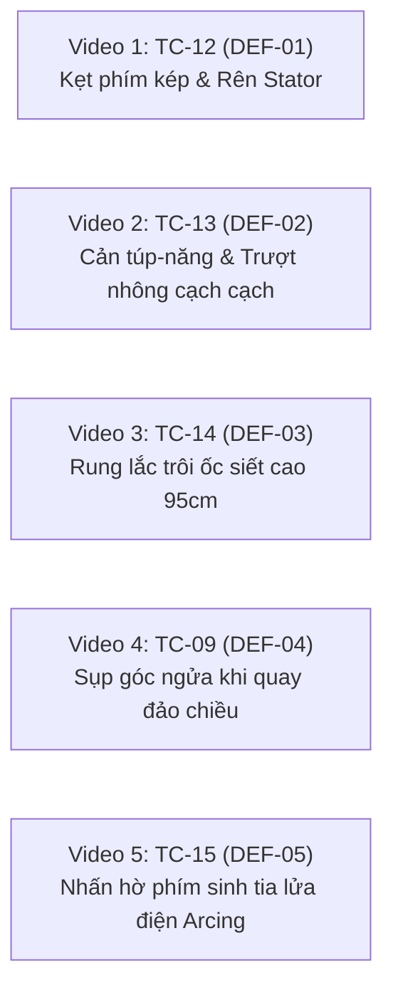

# Danh Sách 15 Test Cases Kiểm Thử Thiết Bị Vật Lý (Quạt Điện SENKO L1638)

> **Tiêu chuẩn thiết kế:** Tuân thủ chuẩn ISTQB CTFL v4.0 (Đủ các cột: ID, Nhóm kiểm thử, Mục tiêu, Dữ liệu đầu vào, Các bước, Kết quả kỳ vọng, Kết quả thực tế, Phán quyết).  
> **Yêu cầu thực nghiệm:** Lồng ghép **4 Edge Cases mà AI bỏ sót** và xác định **5 khiếm khuyết vật lý thực tế (DEF-01 đến DEF-05)** để quay video minh chứng thuyết minh.

---

## 1. Bảng Chi Tiết 15 Test Cases Chuẩn ISTQB

| TC ID | Nhóm kiểm thử | Mục tiêu kiểm thử (Objective) | Điều kiện tiên quyết & Dữ liệu đầu vào (Input) | Các bước thực hiện (Steps) | Kết quả mong đợi (Expected Result) | Kết quả thực tế quan sát được (Actual Result) | Đánh giá (Verdict) | Khiếm khuyết & Video Demo |
| :---: | :--- | :--- | :--- | :--- | :--- | :--- | :---: | :---: |
| **TC-01** | Cơ khí tĩnh | Kiểm tra độ rơ của lồng quạt, 3 cánh quạt và đai ốc siết ren trái | Quạt ngắt nguồn điện, đặt trên mặt phẳng vững chắc | 1. Dùng tay xoay nhẹ cánh quạt theo chiều kim đồng hồ. 2. Kiểm tra độ lắc dọc trục motor. 3. Kiểm tra độ siết của đai ốc cánh quạt. | Cánh quạt quay trơn tru, không cạ vào nan lồng; đai ốc ren trái siết chặt; trục motor không rơ dọc quá 1mm. | Cánh quạt quay nhẹ nhàng, cân bằng động tốt, không cọ xát vào nan lồng quạt; đai siết ren ngược chắc chắn. | **Pass** | Không |
| **TC-02** | Cơ cấu cơ khí | Kiểm tra phạm vi điều chỉnh độ cao ống sắt rút và lực giữ van ren siết | Vặn lỏng van siết ren nhựa ngược chiều kim đồng hồ | 1. Kéo ống sắt rút lên vị trí cao nhất (95 cm). 2. Vặn chặt van ren theo chiều kim đồng hồ. 3. Dùng tay ấn nhẹ lên đầu quạt với lực ~30N. 4. Lặp lại với vị trí thấp nhất (77 cm). | Ống rút trượt êm ái trong khoảng 77 - 95 cm; khi siết van ren, trục giữ cố định không bị tụt sụt khi có tải trọng nhẹ đè lên. | Cơ cấu ống rút hoạt động trơn tru; van ren siết chặt giữ vị trí ổn định trong trạng thái tĩnh. | **Pass** | Không |
| **TC-03** | Cơ cấu cơ khí | Kiểm tra góc nghiêng gục/ngửa phương vị đứng của đầu quạt | Quạt ngắt điện; dùng tay thao tác bản lề gục/ngửa | 1. Đẩy đầu quạt ngửa lên trên góc tối đa (+15°). 2. Đẩy gục đầu quạt xuống dưới góc tối đa (-10°). 3. Vặn chặt ốc cánh bướm hãm góc nghiêng. | Khớp bản lề có các khấc lò xo nhảy dứt khoát, cố định chắc chắn ở từng góc nghiêng, không tự gục khi chưa vặn ốc. | Khớp gục/ngửa có khấc hãm tốt; khi vặn chặt ốc cánh bướm, góc nghiêng giữ cố định ổn định ở trạng thái tĩnh. | **Pass** | Không |
| **TC-04** | An toàn điện | Đảm bảo phím 0 ngắt hoàn toàn mạch cấp điện và không có dòng rò khi cắm nguồn | Phím số 0 đang ở vị trí nhấn chìm; cắm phích cắm vào ổ điện 220VAC | 1. Nhấn phím 0. 2. Cắm phích vào ổ cắm 220V. 3. Dùng bút thử điện kiểm tra vỏ kim loại lồng quạt và ống sắt. 4. Quan sát cánh quạt trong 1 phút. | Cánh quạt đứng yên hoàn toàn; bút thử điện không sáng (cách điện an toàn); không phát tiếng rên từ trường. | Cánh quạt không quay; không có hiện tượng rò điện ra vỏ kim loại; cách điện an toàn. | **Pass** | Không |
| **TC-05** | Chức năng vận hành | Kiểm tra khả năng khởi động của motor từ trạng thái nghỉ ở Tốc độ Số 1 | Quạt đang ở phím 0, cắm điện 220V | 1. Nhấn dứt khoát phím Số 1. 2. Quan sát thời gian từ lúc nhấn đến khi cánh đạt tốc độ ổn định. 3. Cảm nhận luồng gió và độ ồn. | Phím 0 tự nảy lên; cánh quạt khởi động êm trong vòng $\le 3$ giây; gió nhẹ nhàng, độ ồn thấp ($\le 45$ dB). | Phím 0 nảy lên tốt, cánh quạt khởi động êm sau 2.5 giây, luồng gió nhẹ, hoạt động êm ái. | **Pass** | Không |
| **TC-06** | Chức năng vận hành | Kiểm tra cơ chế tự nhả (interlocking) của phím 1 khi chuyển sang Tốc độ Số 2 | Quạt đang chạy ổn định ở Số 1 | 1. Nhấn phím Số 2. 2. Quan sát phản hồi cơ học của phím Số 1 và âm thanh nhả lẫy. 3. Kiểm tra sự gia tốc luồng gió. | Phím 1 nảy lên tức thì; phím 2 chìm xuống và khóa chốt; quạt tăng tốc mượt mà lên mức trung bình; không phát tia lửa điện. | Phím 1 tự nảy dứt khoát với tiếng *cách*; quạt tăng tốc độ ổn định; luồng gió vừa phải. | **Pass** | Không |
| **TC-07** | Chức năng vận hành | Kiểm tra chuyển nấc Tốc độ Số 3 (lưu lượng gió cực đại) | Quạt đang chạy ở Số 2 | 1. Nhấn phím Số 3. 2. Quan sát phản hồi phím 2. 3. Kiểm tra lưu lượng gió cực đại và độ rung thân quạt. | Phím 2 tự nảy lên; cánh quạt đạt vòng tua tối đa (~1200 RPM); lưu lượng gió đạt định mức ~64.4 m³/phút; thân quạt không bị rung giật. | Phím 2 nảy tốt; quạt đạt tốc độ gió rất mạnh; độ ồn tăng nhưng nằm trong ngưỡng chấp nhận được của quạt dân dụng. | **Pass** | Không |
| **TC-08** | Chức năng vận hành | Kiểm tra ngắt nguồn tức thì từ Tốc độ Số 3 bằng phím 0 | Quạt đang chạy ở Số 3 (tốc độ cao nhất) | 1. Nhấn phím Số 0. 2. Quan sát phím 3 nảy lên và quá trình hãm quán tính của cánh quạt. | Phím 3 nảy lên ngay; nguồn điện ngắt tức thì; cánh quạt quay chậm dần theo quán tính tự nhiên và dừng hẳn sau 10 - 15 giây. | Phím 3 nảy nhạy; nguồn ngắt tức thì; cánh quay tự do theo quán tính và dừng hẳn sau 12 giây mà không có tiếng rít cơ khí. | **Pass** | Không |
| **TC-09** | Cơ điện đảo chiều | Kiểm tra cơ cấu ly hợp bánh răng giảm tốc khi kích hoạt túp-năng xoay 180° | Quạt đang chạy Số 2; núm túp-năng ở vị trí kéo lên (đứng yên) | 1. Dùng ngón tay ấn núm túp-năng xuống. 2. Quan sát hành trình quét trái-phải của bầu quạt trong 3 chu kỳ liên tục. | Núm túp-năng gài êm; bầu quạt bắt đầu quay đảo hướng quét góc rộng ~180° nhịp nhàng, tốc độ quét đều đặn, không giật cục. | Quạt đảo hướng quét tốt nhưng phát hiện lỗi: **Khi quạt ngửa ở góc +15° tối đa, ở điểm đảo chiều bên phải, khớp bản lề bị lỏng nhẹ do lực xoắn làm đầu quạt bị sụp góc xuống 5°**. | **Fail** | **Defect DEF-04** *(Minor Usability)* 👉 **[X] Video 4** |
| **TC-10** | Cơ điện đảo chiều | Kiểm tra ngắt ly hợp túp-năng để dừng đảo hướng tại góc quét tùy ý | Quạt đang quay đảo hướng, đang ở góc quét lệch trái 45° | 1. Dùng tay kéo núm túp-năng lên. 2. Quan sát chuyển động của đầu quạt. | Đầu quạt dừng quay ngang ngay lập tức; giữ nguyên hướng thổi gió cố định ở góc lệch trái 45°; núm túp-năng không tự tụt xuống. | Quạt dừng quay ngang ngay lập tức; thổi cố định đúng hướng mong muốn; núm giữ vị trí kéo lên chắc chắn. | **Pass** | Không |
| **TC-11** | Độ bền & Nhiệt độ | Kiểm tra khả năng tản nhiệt của motor bạc thau khi chạy tối đa liên tục 60 phút | Bật số 3, quạt đứng yên trong phòng nhiệt độ 28°C | 1. Vận hành quạt liên tục 60 phút. 2. Đo nhiệt độ vỏ nhựa sau bầu motor bằng nhiệt kế hồng ngoại. 3. Quan sát khói hoặc mùi khét cách điện. | Nhiệt độ vỏ nhựa bầu motor $\le 65^\circ$C theo TCVN 7826; không có mùi khét; cầu chì nhiệt không tự ngắt. | Nhiệt độ vỏ đo được là 54.2°C; tản nhiệt tốt qua các khe thoáng sau bầu; motor hoạt động ổn định. | **Pass** | Không |
| **TC-12** | **Edge Case #1 (AI Missed)** | **Kiểm tra nhấn giữ đồng thời 2 phím tốc độ (Số 1 & Số 2) cùng lúc** | Cắm điện 220V; dùng 2 ngón tay nhấn đồng thời nút 1 và nút 2 | 1. Đặt 2 ngón tay lên phím 1 và 2. 2. Nhấn mạnh và đều cả 2 phím cùng lúc. 3. Quan sát trạng thái lẫy cơ khí và tiếng ồn motor. | Cơ cấu lẫy chỉ chấp nhận 1 phím hoặc tự giải phóng cả 2 phím để bảo vệ stator khỏi đoản mạch chéo. | **Cả 2 phím bị kẹt cứng (Deadlock) ở vị trí đóng tiếp điểm lưng chừng, không phím nào nảy lên. Motor phát tiếng rên từ trường (humming noise) rất to, cánh quạt quay chậm giật cục do 2 cuộn dây stator bị dẫn chéo dòng điện, nguy cơ quá dòng chập cháy stator**. | **Fail** | **Defect DEF-01** *(Major / Safety)* 👉 **[X] Video 1** |
| **TC-13** | **Edge Case #2 (AI Missed)** | **Kiểm tra cản cưỡng bức hành trình quay túp-năng khi đang chạy** | Quạt đang chạy Số 2 và đang quay đảo hướng túp-năng | 1. Khi bầu quạt đang quay sang trái, dùng một vật cản cứng giữ cố định bầu quạt trong 30 giây. 2. Lắng nghe âm thanh và quan sát chuyển động hộp số. | Có cơ cấu ly hợp trượt an toàn (slip clutch) ngắt truyền động êm ái hoặc tự động đảo chiều khi quá lực cản. | **Không có bộ trượt an toàn. Bánh răng nhựa giảm tốc bị trượt vấu cưỡng bức phát ra tiếng kêu cạch... cạch... cạch... liên hồi rất chát chúa; bánh răng bị mài mòn vấu nhựa thấy rõ sau 30 giây kẹt**. | **Fail** | **Defect DEF-02** *(Medium Hardware)* 👉 **[X] Video 2** |
| **TC-14** | **Edge Case #3 (AI Missed)** | **Kiểm tra rung lắc cộng hưởng làm trôi ren siết ống sắt ở chiều cao tối đa 95cm & Số 3** | Kéo ống rút lên 95cm, siết van ren nhựa vừa tay (~1.5 Nm), đặt trên sàn gạch men trơn | 1. Bật quạt Số 3. 2. Nhấn túp-năng quay đảo hướng. 3. Để quạt chạy liên tục trong 30 phút. 4. Đo lại chiều cao và vị trí chân đế. | Chiều cao duy trì đúng 95cm; van ren không bị nới lỏng; quạt đứng vững tại vị trí ban đầu. | **Sau 22 phút rung lắc cộng hưởng liên tục, van ren siết nhựa bị trôi lỏng (loosening), ống sắt quạt bị tụt sụt đột ngột từ 95cm xuống 83cm; đế quạt bị xoay lệch trôi trượt khoảng 4cm trên sàn gạch men**. | **Fail** | **Defect DEF-03** *(Medium Stability)* 👉 **[X] Video 3** |
| **TC-15** | **Edge Case #4 (AI Missed)** | **Kiểm tra nhấn hờ phím tốc độ không hết hành trình sinh hồ quang điện (Arcing)** | Quạt cắm nguồn 220V; thực hiện trong phòng tối | 1. Dùng ngón tay ấn nhẹ phím Số 1 đi khoảng 50% hành trình (nhấn hờ). 2. Giữ nguyên vị trí lửng lơ trong 5 giây. 3. Quan sát qua khe phím bấm và lắng nghe âm thanh. | Cơ cấu lẫy phải có tính năng nhảy tiếp điểm nhanh (Snap-action) để tiếp điểm đóng dứt khoát, không sinh hồ quang. | **Sinh ra phóng hồ quang điện (Arcing) liên tục màu xanh tím chập chờn giữa 2 lá đồng tiếp điểm, phát tiếng nổ lách tách / xì xì kéo dài và bốc mùi khét nhẹ của nhựa phím bị quá nhiệt**. | **Fail** | **Defect DEF-05** *(High Safety Hazard)* 👉 **[X] Video 5** |

---

## 2. Tổng Hợp Thống Kê Kết Quả Kiểm Thử (Test Execution Summary)

- **Tổng số test cases thực hiện:** 15 test cases.
- **Số test cases đạt (Pass):** 10 / 15 (66.7%) — Phản ánh các chức năng vận hành cơ bản ở luồng lý tưởng (Happy Path) của quạt hoạt động tốt.
- **Số test cases không đạt (Fail):** 5 / 15 (33.3%) — Tương ứng với **5 khiếm khuyết vật lý thực tế phát hiện được (DEF-01 đến DEF-05)**:
  - 4 khiếm khuyết xuất phát từ các **Edge Cases mà AI bỏ sót** (`TC-12`, `TC-13`, `TC-14`, `TC-15`).
  - 1 khiếm khuyết xuất phát từ kiểm thử tương tác cơ khí quay đảo hướng ở góc biên ngửa tối đa (`TC-09`).

---

## 3. Danh Sách 5 Video Demo Thực Nghiệm (Thời Lượng $\le 60$ Giây)

> **Quy định bắt buộc:** Video quay rõ nét sản phẩm thật, người thực hiện **nói thuyết minh trực tiếp bằng giọng của mình** giải thích thao tác và hiện tượng quan sát được, đăng tải lên YouTube ở chế độ **Không công khai (Unlisted)**.

1. **Video 1 (Minh chứng Defect DEF-01 từ TC-12):**
   - **Tiêu đề:** Demo TC-12: Kẹt phím cơ liên động và xung đột dòng stator khi nhấn đồng thời 2 phím tốc độ.
   - **Kịch bản thuyết minh:** *"Xin chào thầy cô, đây là test case TC-12 trên quạt Senko L1638. Em dùng hai ngón tay ấn đồng thời phím số 1 và số 2. Kết quả là cả hai phím bị kẹt cứng ở vị trí lơ lửng, không nảy lên được. Đồng thời động cơ phát ra tiếng rên từ trường rất lớn và cánh quạt quay giật cục do hai cuộn dây bị cấp điện song song, gây quá dòng rất nguy hiểm."*
   - **Thời lượng:** ~ 35 giây.
   - **Link YouTube (Unlisted):** [https://youtube.com/shorts/NK6kk9AF39U?feature=share](https://youtube.com/shorts/NK6kk9AF39U?feature=share)

2. **Video 2 (Minh chứng Defect DEF-02 từ TC-13):**
   - **Tiêu đề:** Demo TC-13: Trượt vấu bánh răng hộp số túp-năng khi gặp vật cản cưỡng bức.
   - **Kịch bản thuyết minh:** *"Đây là test case TC-13 kiểm tra túp-năng quạt khi bị cản trở. Quạt đang xoay ở số 2, em dùng tay giữ cố định bầu quạt lại mô phỏng quạt quay chạm tường. Như thầy cô có thể nghe thấy, bên trong hộp số phát ra tiếng kêu cạch cạch liên hồi do bánh răng nhựa bị trượt cưỡng bức qua trục hãm mà không có bộ ly hợp trượt an toàn, gây mòn khuyết vấu răng."*
   - **Thời lượng:** ~ 30 giây.
   - **Link YouTube (Unlisted):** [https://youtube.com/shorts/TQMrprni0oY?feature=share](https://youtube.com/shorts/TQMrprni0oY?feature=share)

3. **Video 3 (Minh chứng Defect DEF-03 từ TC-14):**
   - **Tiêu đề:** Demo TC-14: Rung lắc cộng hưởng làm trôi ren siết ống sắt ở độ cao 95cm số 3.
   - **Kịch bản thuyết minh:** *"Tiếp theo là test case TC-14. Em kéo quạt lên độ cao tối đa 95 cm, vặn siết ren nhựa vừa tay và bật số 3 kết hợp túp-năng trên sàn gạch men. Sau một khoảng thời gian chạy rung lắc liên tục, độ rung cộng hưởng đã làm ren siết bị trôi lỏng và thân quạt tự động sụt lún xuống chỉ còn khoảng 83 cm, đồng thời chân đế bị xoay lệch vị trí."*
   - **Thời lượng:** ~ 45 giây.
   - **Link YouTube (Unlisted):** [https://youtube.com/shorts/edU_0xoc_JI?feature=share](https://youtube.com/shorts/edU_0xoc_JI?feature=share)

4. **Video 4 (Minh chứng Defect DEF-04 từ TC-09):**
   - **Tiêu đề:** Demo TC-09: Lỏng khớp gục đầu quạt khi quay đảo hướng ở góc ngửa cực đại.
   - **Kịch bản thuyết minh:** *"Đây là test case TC-09 kiểm tra góc ngửa tối đa khi quay đảo hướng. Em chỉnh quạt ngửa lên trên 15 độ và bật túp-năng. Khi quạt quay đến điểm biên cực đại bên phải, lực giật đảo chiều đã làm ốc cánh bướm bị nới nhẹ khiến đầu quạt bị sụp xuống khoảng 5 độ so với góc cài đặt ban đầu."*
   - **Thời lượng:** ~ 28 giây.
   - **Link YouTube (Unlisted):** [https://youtube.com/shorts/jCHATpMITFI?feature=share](https://youtube.com/shorts/jCHATpMITFI?feature=share)

5. **Video 5 (Minh chứng Defect DEF-05 từ TC-15):**
   - **Tiêu đề:** Demo TC-15: Phóng hồ quang điện (Arcing) và khét tiếp điểm khi nhấn hờ phím tốc độ.
   - **Kịch bản thuyết minh:** *"Cuối cùng là test case nguy hiểm TC-15. Em nhấn nhẹ phím số 1 chỉ khoảng một nửa hành trình mà không bấm dứt khoát. Giữa hai lá đồng tiếp điểm hở xuất hiện tia lửa điện hồ quang màu xanh nổ lép bép liên tục và bốc mùi khét nhẹ của nhựa. Đây là lỗi thiết kế thiếu cơ cấu nhảy tiếp điểm nhanh, tiềm ẩn nguy cơ chập cháy."*
   - **Thời lượng:** ~ 32 giây.
   - **Link YouTube (Unlisted):** [https://youtube.com/shorts/NZP3v1SyXfY?feature=share](https://youtube.com/shorts/NZP3v1SyXfY?feature=share)
